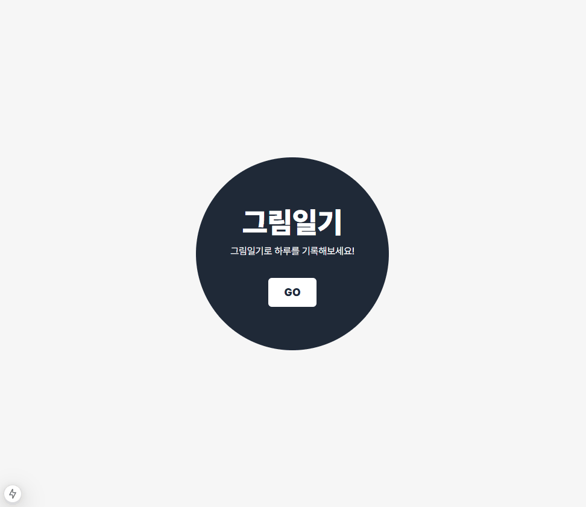
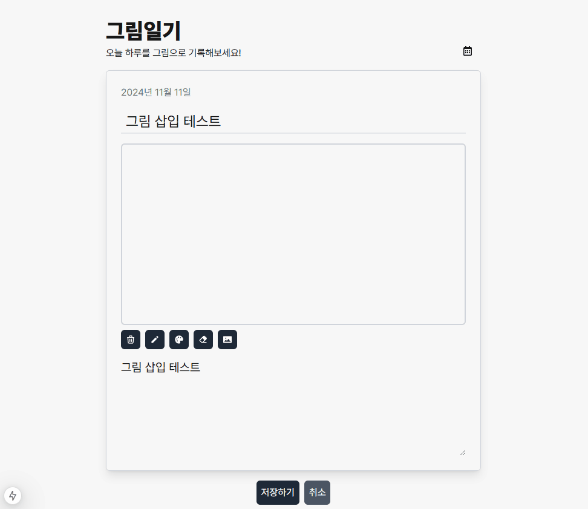
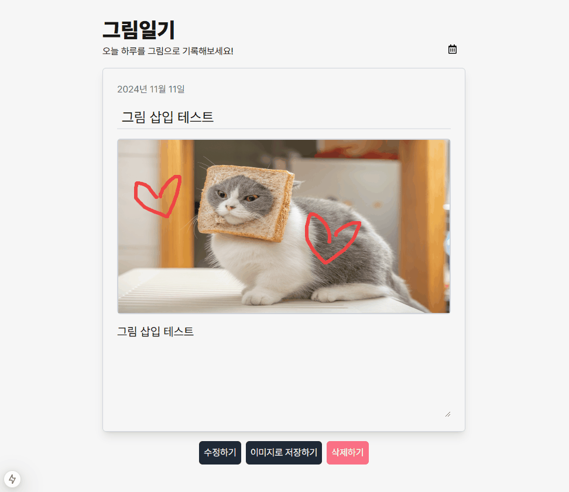
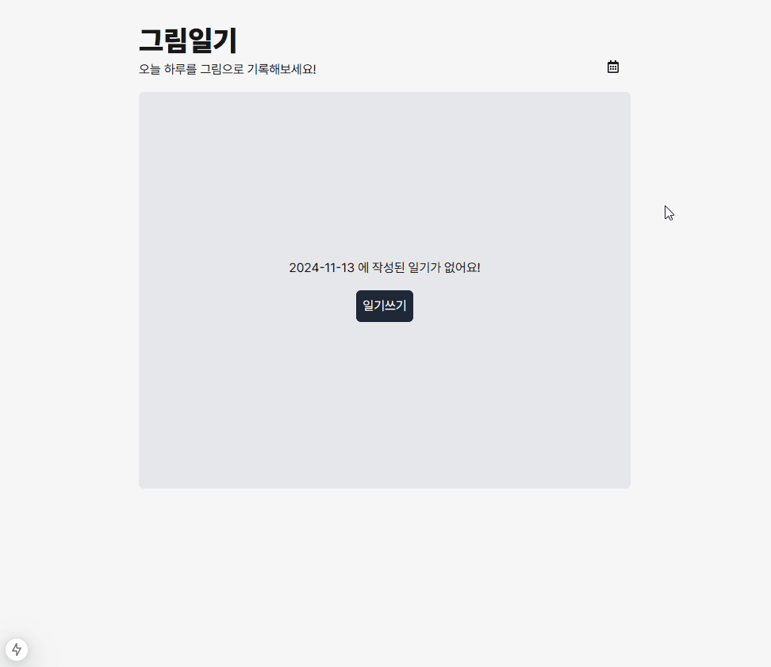
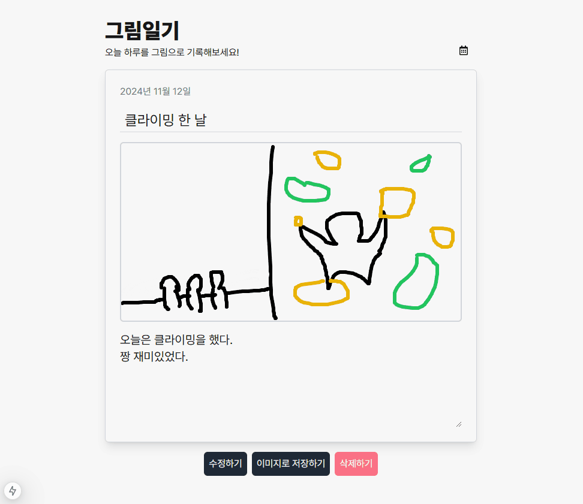

# 그림일기

그림일기 과제를 제출합니다.

## 실행

Node.js v20.11.0
Yarn v1.22.21

패키지 설치

```
yarn
```

데이터베이스 초기화

```
node initdb.ts
```

실행

```
yarn dev
```

<br/>

## 주요 기능

### 그림일기 쓰기



<br/>

- 제목, 그림, 내용으로 구성된 일기를 쓸 수 있습니다.
- 펜의 굵기, 펜의 색을 변경할 수 있습니다.
- 전체 지우기 및 부분 지우개를 사용할 수 있습니다.

<br/>



<br/>

- 이미지를 삽입하고 그 위에 그림을 그릴 수 있습니다.

<br/>

### 그림일기 수정 및 삭제



<br/>
- 그림일기를 수정하고 삭제할 수 있습니다.

<br/>

### 달력으로 그림일기 조회



<br/>

- 달력으로 날짜를 선택하면 해당 날짜의 일기를 조회할 수 있습니다.
- 해당 날짜의 일기가 있다면 달력에 빨간 점으로 나타납니다.

<br/>

### 이미지 저장



<br/>

- 작성한 일기를 이미지로 저장할 수 있습니다.

<br/>

## 라이브러리 & 프레임워크

- Next.js
- React.js
- TailwindCSS
- html2canvas : 일기 캡쳐 후 이미지 다운로드
- date-fns : 날짜 포맷 변환
- react-calendar : 달력 UI
- react-hook-form : form 상태 관리
- react-icons : 아이콘 사용
- better-sqlite3 : SQLite3를 node.js 환경에서 쉽게 사용
- axios
- tanstack/react-query

<br/>

## 구현 Details

### Backend

- better-sqlite3 를 사용하여 SQLite를 사용한 DB를 만들었습니다.
- Next.js API route를 사용하여 API를 구현하였습니다.

### Frontend

- axios를 사용하여 get, post, delete, patch 요청에 각각 사용할 수 있는 함수를 만들어 사용했습니다.
- react-query 를 사용하여 캐싱을 하였고, 데이터 변경 시 reset하였습니다.
- react-query의 queryCache를 사용하여 GET 요청에 대한 전역적인 에러 관리를 하였습니다.
- tailwindCSS의 layer를 사용하여 스타일 코드를 재사용해 가독성을 높였습니다.
- 그림판 기능은 html canvas를 사용하였고, useRef 등 React hook을 사용해 context를 제어했습니다.

<br/>

## 구현 중 발생한 Issue

### hydration error

`new Date()`로 현재 날짜를 가져올때 SSR로 인한 hydration error가 발생했습니다.

- client side 에서 구한 날짜와 server side 에서 구한 날짜가 타이밍상 다를 수 밖에 없기 때문에 발생하는 에러였습니다.
- `'use client'`를 선언한 컴포넌트에서 사용하거나 혹은 컴포넌트로 뺀 다음 dynamic import에서 SSR 옵션을 false로 주는 방법으로 해결할 수 있었습니다.

### TailwindCSS dynamic classname

TailwindCSS 사용시 dynamic하게 classname을 설정해서는 안되고, static 한 classname을 조건부로 사용해야 합니다.

- AS-IS

```
bg-[${color}]
```

- TO-BE

```
 { color: "#ef4444", bg: "bg-[#ef4444]", }
```

이렇게 한꺼번에 static한 classname을 저장해두고 꺼내쓰는 방식으로 변경하여 해결했습니다.
